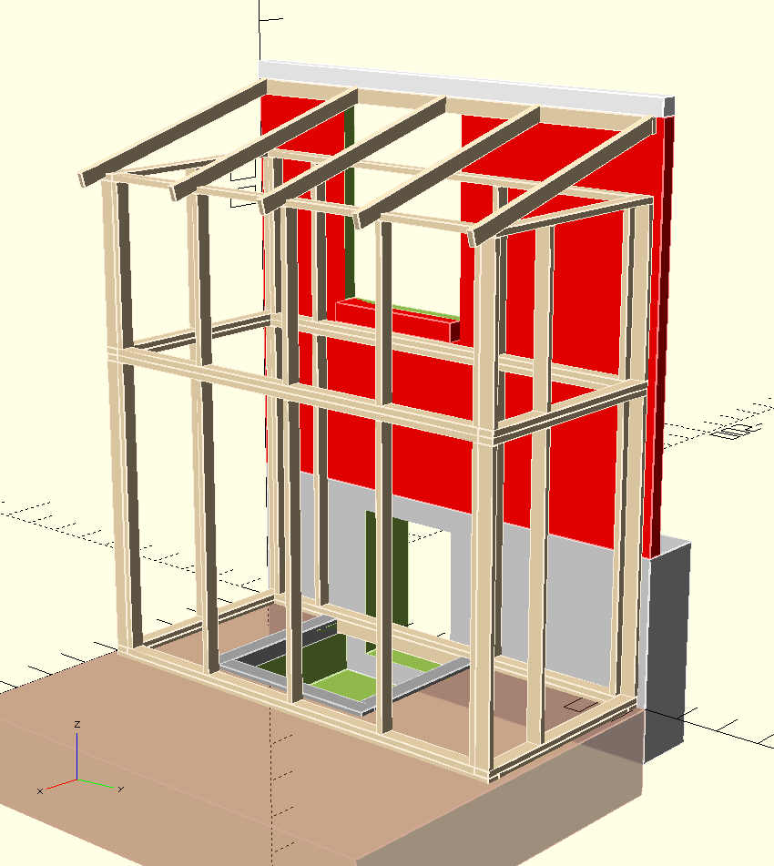

# catio.scad

A [parametric design](https://en.wikipedia.org/wiki/Solid_modeling#Parametric_modeling)
for an attached cat patio ("catio"). A project to help me learn
[OpenSCAD](https://www.openscad.org/), and to help my cats learn
[gratitude](https://en.wikipedia.org/wiki/Gratitude). The project was a
success on one of these two fronts.

## Features

+ Entry and exit via side hatch (human) or window-mounted cat door (cat).
+ Two adjustable tiers.
+ Adjustable global dimensions.
+ Adjustable beam dimensions (2x4, 1x2, etc...).
+ Configurable stud and rafter placement and count.

## Construction and Installation

Firstly...

### Disclaimer

Nobody who has worked on or reviewed this project is a professional architect,
structural engineer, or any other certified practitioner of any field relevant
to the construction or installation of this structure. Per the terms in the
[license](LICENSE), this project is provided without warranty of any kind.

### Steps

_Work in progress_

TODO: beam.scad will echo a cut list based on the beams used in the design.

1. Acquire dimensional lumber and cut to length according to the cut list.

2. Assemble foundation using metal ties.

...

3. Use spools of steel strap to create "X" pattens across the four vertical
   sides of both tiers. Due to the lack of a deep foundation on the far side
   of the structure, the diagonal ties on the left and right sides are
   especially important. The structure may want to sag on the far side over
   time.

4. Staple something like chicken wire to the studs for the walls.

5. Attach fiberglass sheets to the rafters for the roof.

## Render

